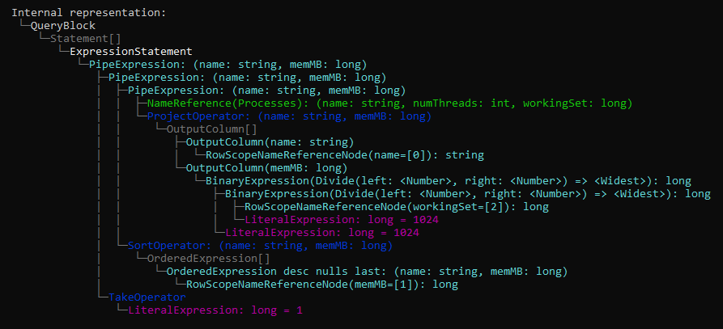

[](https://www.nuget.org/packages/BabyKusto.Core)

# BabyKusto

BabyKusto is a self-contained execution engine for the [Kusto Query Language](https://docs.microsoft.com/en-us/azure/data-explorer/kusto/query/) (KQL). See a [live demo](https://babykusto.azurewebsites.net/).


## How to use

Queries that don't rely on any external data can be evaluated with as little as two lines of code:

```cs
var query = "print hello='world'";

var engine = new BabyKustoEngine();
var result = engine.Evaluate(query);
result.Dump(Console.Out);
```

Most real world scenarios will want to operate on real data sourced from elsewhere.
For that, BabyKusto allows you to register an `ITableSource` with any name in the global scope.
The [**ProcessQuerier**](./samples/BabyKusto.ProcessQuerier) sample
shows how to feed live data to BabyKusto with this mechanism.

```cs
var query = @"MyTable | summarize c = count() by AppMachine";

ITableSource myTable = /*...*/; // Get your data from anywhere
var engine = new BabyKustoEngine();
engine.AddGlobalTable("MyTable", myTable);

var result = engine.Evaluate(query);
result.Dump(Console.Out);
```

This repo ships with three ready-to-run samples that showcase BabyKusto in action.

* [**HelloWorld**](./samples/BabyKusto.HelloWorld): as simple as it gets, shows how to run a simple query.

* [**ProcessQuerier**](./samples/BabyKusto.ProcessQuerier): a command-line tool that lets you explore processes running on your machine using KQL. For example, find the process using the most memory with a query like this:
  ```
  Processes
  | project name, memMB=workingSet/1024/1024
  | order by memMB desc
  | take 1
  ```

* [**BlazorApp**](./samples/BabyKusto.BlazorApp): a web-facing demo that lets you query an arbitrary CSV file using KQL queries. [Live demo](https://babykusto.azurewebsites.net/).


## How it works

BabyKusto leverages the official [`Microsoft.Azure.Kusto.Language`](https://www.nuget.org/packages/Microsoft.Azure.Kusto.Language/) package for parsing and semantic analysis of KQL queries.

The syntax tree is then translated to BabyKusto's internal representation (see [InternalRepresentation](./src/BabyKusto.Core/InternalRepresentation)), which is evaluated by [BabyKustoEvaluator.cs](./src/BabyKusto.Core/Evaluation/BabyKustoEvaluator.cs).

You can explore the internal representation of a query by setting `dumpIRTree: true` when calling `BabyKustoEngine.Evaluate`.
Below is an example of the internal representation for the query:

```
Processes
| project name, memMB=workingSet/1024/1024
| order by memMB desc
| take 1
```



## Contributing

This project welcomes contributions and suggestions.  Most contributions require you to agree to a
Contributor License Agreement (CLA) declaring that you have the right to, and actually do, grant us
the rights to use your contribution. For details, visit https://cla.opensource.microsoft.com.

When you submit a pull request, a CLA bot will automatically determine whether you need to provide
a CLA and decorate the PR appropriately (e.g., status check, comment). Simply follow the instructions
provided by the bot. You will only need to do this once across all repos using our CLA.

This project has adopted the [Microsoft Open Source Code of Conduct](https://opensource.microsoft.com/codeofconduct/).
For more information see the [Code of Conduct FAQ](https://opensource.microsoft.com/codeofconduct/faq/) or
contact [opencode@microsoft.com](mailto:opencode@microsoft.com) with any additional questions or comments.

## Trademarks

This project may contain trademarks or logos for projects, products, or services. Authorized use of Microsoft 
trademarks or logos is subject to and must follow 
[Microsoft's Trademark & Brand Guidelines](https://www.microsoft.com/en-us/legal/intellectualproperty/trademarks/usage/general).
Use of Microsoft trademarks or logos in modified versions of this project must not cause confusion or imply Microsoft sponsorship.
Any use of third-party trademarks or logos are subject to those third-party's policies.
