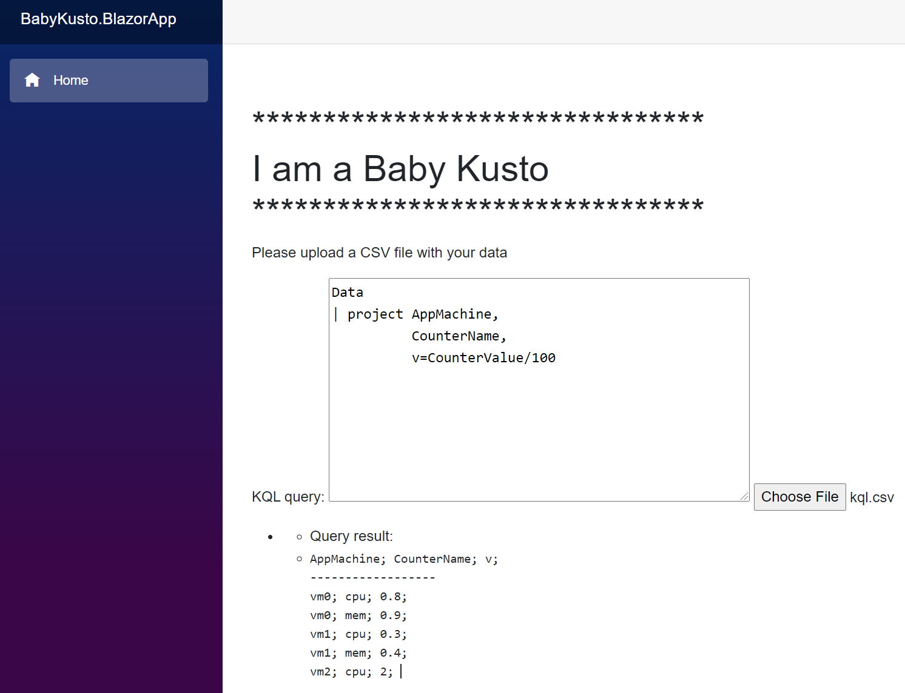
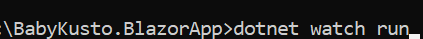

## BabyKusto.BlazorApp
A simple UI that you can upload your csv file and query against it. [Live demo](https://babykusto.azurewebsites.net/).

To run the app locally, just build the solution, and run dotnet watch run inside the BabyKusto.BlazorApp directory:

